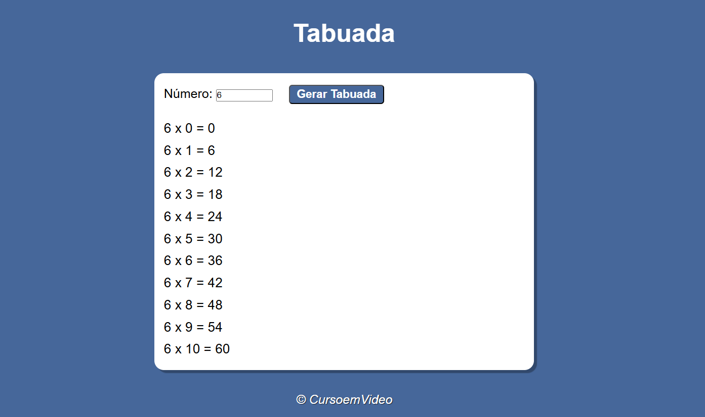

# Exercitando JavaScript 

#### Exercícios praticados durante curso de JavaScript do Gustavo Guanabara (Curso em Vídeo).

## Contador

Função criada em JavaScript que recebe 3 valores (inicio do contador, final e ao passo de) e retorna uma sequência numérica (que pode ser crescente ou decrescente) de acordo com o intervalo definido. 
Com isso, pude praticar a validação dos inputs, uso da estrutura de repetição for e formatação de emojis no JavaScript. 

### Preview:

#### [Acesse online](https://dilene-carvalho.github.io/exercicios-JS/exercicio-contador/)

## Saudação   

Função criada em JavaScript para fazer uma saudação ao usuário, de acordo com o horário de seu acesso (período da madrugada, manhã, tarde ou noite). Além da mensagem de saudação, outros elementos da página se alteram, como cor de fundo e imagem. 

## Preview:

#### [Acesse online](https://dilene-carvalho.github.io/exercicios-JS/exercicio-saudacao/)

## Tabuada 

Função que recebe um número do usuário e retorna o mesmo multiplicado de 0 a 10. 

## Preview:

#### [Acesse online](https://dilene-carvalho.github.io/exercicios-JS/exercicio-tabuada/)

## Verificador de Idade  

Função que verifica dois dados de input do usuário (ano de nascimento e sexo) e retorna esses dados em uma mensagem com uma imagem ilustrativa (se é homem ou mulher, se é criança, jovem, adulto ou idoso). 
Com isso, pude praticar a validação dos inputs e também a possibilidade de criar um novo elemento através do JavaScript, com o uso do "createElement", "setAttribute" e "appendChild". 

## Preview:

#### [Acesse online](https://dilene-carvalho.github.io/exercicios-JS/exercicio-verificador/)

