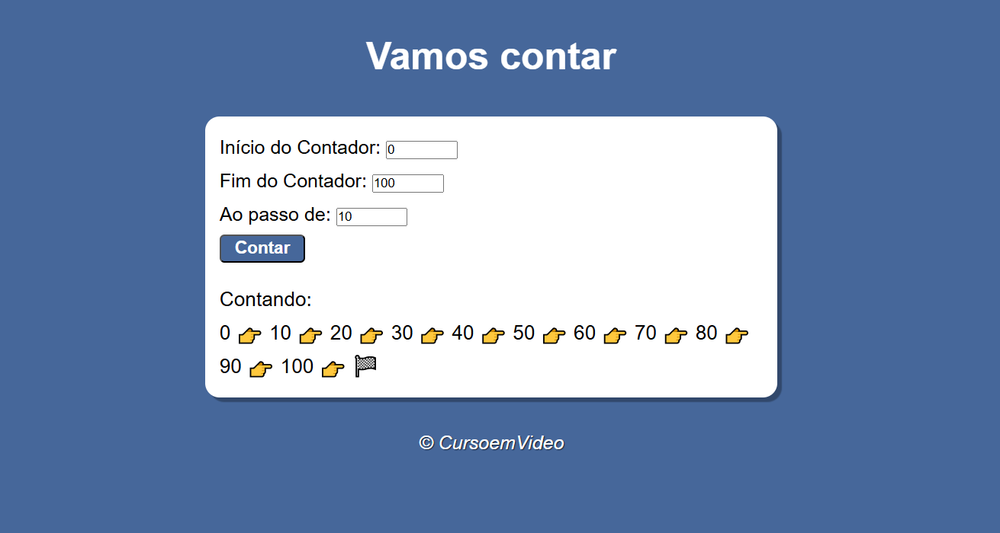

# Contador - Exercitando JS  

Função criada em JavaScript que recebe 3 valores (inicio do contador, final e ao passo de) e retorna uma sequência numérica (que pode ser crescente ou decrescente) de acordo com o intervalo definido. 

Com isso, pude praticar a validação dos inputs, uso da estrutura de repetição for e formatação de emojis no JavaScript. 

## Acesse online: 

[Exercício - Contador](https://dilene-carvalho.github.io/exercicio-contador/)

## Preview:

